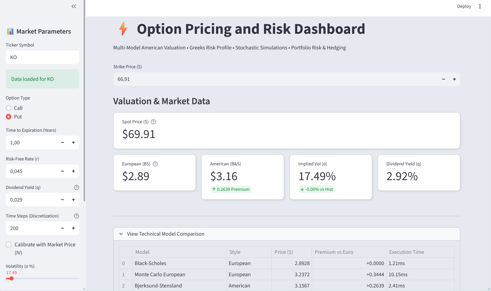

# ⚡ Option Pricing & Risk Management Dashboard


> **Interactive Quantitative Finance tool bridging theoretical pricing models with practical risk management.**

---

## Interface Preview



---

## Overview

This project is an Option Pricing & Risk Management Dashboard built with Python and Streamlit. Unlike standard calculators that rely solely on Black-Scholes, this engine specializes in the valuation of American Options using advanced numerical methods (PDEs, Binomial/Trinomial Trees, and Monte Carlo LS).

Designed for quants and traders, it fetches real-time market data to perform live risk analysis, visualizing non-linear sensitivities (3D Greeks), calculating Value at Risk (VaR), and determining optimal early exercise boundaries.

It solves a common problem: **How to accurately value American options and visualize non-linear portfolio risks?**

## Key Features

### Multi-Model Pricing Engine
Compare valuation across 6 different mathematical models:
* **Black-Scholes-Merton:** Baseline for European options.
* **Bjerksund-Stensland (2002):** Closed-form approximation for American options.
* **Binomial & Trinomial Trees:** Cox-Ross-Rubinstein models (CRJ) for lattice-based pricing.
* **Finite Difference Method (FDM):** Solves the PDE using the Theta-scheme (Implicit/Crank-Nicolson).
* **Monte Carlo (Longstaff-Schwartz):** Least Squares Method (LSM) for American options simulation.

### Advanced Risk Analytics
* **Greeks Visualization:** Interactive 2D plots and **3D Heatmaps** for Delta, Gamma, Vega, Theta, and Rho.
* **Optimal Exercise Boundary:** visualizes the precise price/time threshold where early exercise becomes optimal.
* **Value at Risk (VaR):** Estimates portfolio risk using stochastic simulations with confidence intervals (95%, 99%).
* **P&L Projections:** Dynamic profit/loss analysis based on position size and expiration scenarios.

### Portfolio Management Tools
* **Real-Time Data:** Fetches live spot prices and historical volatility via `yfinance`.
* **Implied Volatility Solver:** Calibrates the model to market prices using Newton-Raphson.
* **Delta Hedging Calculator:** Provides immediate recommendations for Delta-Neutral strategies.

---

## Mathematical Framework
The core engine implements both analytical solutions and advanced numerical methods to handle early exercise features (American options).

### 1. Analytical Benchmark (European)
Black-Scholes-Merton provides the baseline for European valuations.

<div align="center">  </div>

### 2. Lattice Methods (American)
We use the Cox-Ross-Rubinstein (CRR) binomial model. The price is solved via backward induction, checking for optimal exercise at every node.

<div align="center">  </div>


Where <em>p</em> is the risk-neutral probability derived from the volatility <em>σ</em>.

### 3. Finite Difference Method (PDE)
For high-precision pricing, we solve the generalized Black-Scholes Partial Differential Equation using the Theta-Scheme (allowing generic switching between Explicit, Implicit, and Crank-Nicolson methods).

<div align="center">  </div>


The grid is solved as a linear system at each time step: <div align="center">  </div>

### 4. Least Squares Monte Carlo (LSM)
Implemented via the Longstaff-Schwartz (2001) algorithm. We approximate the conditional expectation of continuation value using Laguerre polynomials to determine the optimal stopping time.

<div align="center">  </div>

### 5. Implied Volatility Calibration
Market prices are inverted using the Newton-Raphson root-finding algorithm to extract the implied volatility surface.

<div align="center">  </div>

## Installation & Setup

**Prerequisites:** Python 3.8+

1. **Clone the repository:**
   ```bash
   git clone https://github.com/YOUR-USERNAME/Option-Pricing-Risk-Dashboard.git
   cd Option-Pricing-Risk-Dashboard
   ```

2. **Create a virtual environment (Recommended):**
   ```bash
   python -m venv venv
   source venv/bin/activate  # On Windows use: venv\Scripts\activate
   ```

3. **Install dependencies:**
   ```bash
   pip install -r requirements.txt
   ```

4. **Launch the Dashboard:**
   ```bash
   streamlit run dashboard.py
   ```
   *The app will open in your browser at `http://localhost:8501`*

---

## Project Structure

```text
Option-Pricing-Dashboard/
├── assets/
│   └── overview.png             # Screenshots and diagrams for documentation
├── dashboard.py                 # Main entry point: Streamlit UI, visualization logic, and user inputs
├── models.py                    # European Library: Black-Scholes, Greeks, Implied Volatility, and yfinance data
├── pricing_american_option.py   # American Library: Binomial/Trinomial Trees, PDE (FDM), and Longstaff-Schwartz
├── test_models.py               # Unit Tests: Pytest suite to verify mathematical accuracy
├── test_pricing_american.py     # Unit Tests: Pytest suite to verify mathematical accuracy
├── requirements.txt             # List of Python dependencies
├── .gitignore                   # Git configuration
├── LICENSE                      # GPLv3 License
└── README.md                    # Project documentation
```

---

## Testing

Reliability is paramount in quantitative finance. This project includes a test suite using Pytest.

**Tests cover:**
* Theoretical accuracy (vs Textbook examples).
* Put-Call Parity checks (Arbitrage-free conditions).
* Implied Volatility "Round-Trip" (Input $\sigma$ $\to$ Price $\to$ Solver $\to$ Output $\sigma$).

To run the tests:
```bash
pytest test_models.py
```

---

## Disclaimer

*This project is for educational and research purposes only. It should not be used as the sole basis for real-money trading decisions. Options trading involves significant risk.*

---

## License

Distributed under the MIT License. See `LICENSE` for more information.

**Author:** Paul Trassaert - *Mathematical & Computer Science Student*
